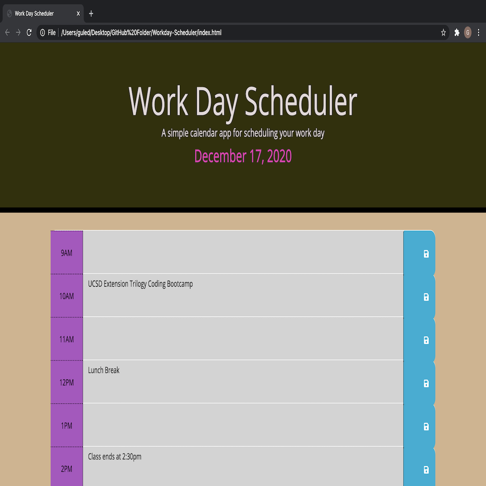
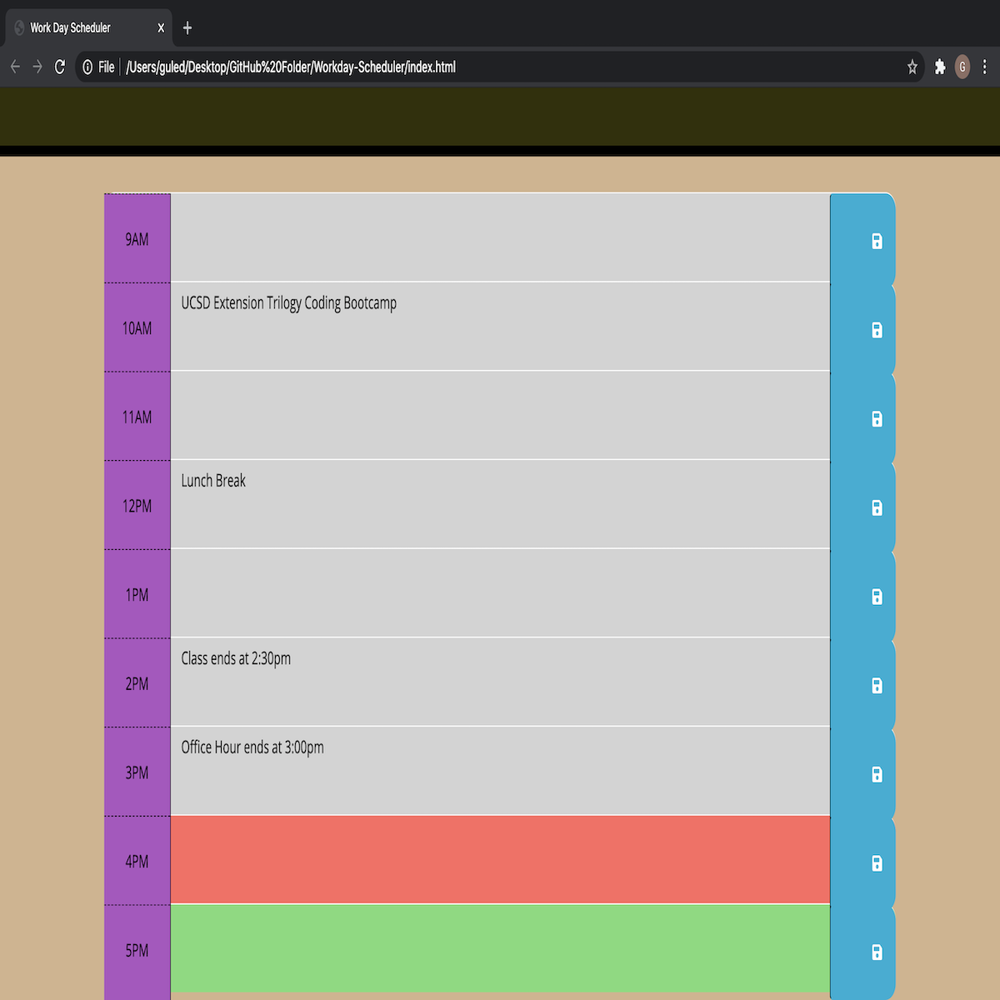

<h1>INTRODUCTION</h1>

During my Coding Bootcamp at the UCSD Trilogy coding program, we were given assignments to work with Javascript and JQuery. This was my third assignment where I worked with using Javascript and JQuery during my experience at the UCSD Triology Coding Program. In my previous project/assignment, I designed an application that allowed the user to generate a random password using lowercase and uppercase letters, numbers and special characters.

 

You can visit the application by clicking <a href="https://guled06.github.io/Workday-Scheduler/">WORKDAY SCHEDULER</a>. I hope this application serves you well and assists you with managing your time to your satisfication.

 

<h1>DESCRIPTION</h1>

This application was designed to let users save events for each hour of their day from 9:00am to 5:00pm (their working day schecude). This app will run in the broweser and feature dynamically updated HTML and CSS, powered by JQuery. I used a library called [Moment.js] (https://momentjs.com/) to work with setting the dates and times. 'Moment.js' has historically been the most popular date/time library, but is no longer supported by it's developers. However, I used it for this project.

 

The application has three main colors for each hour. When the hour is displaying a gray color, the application is informing the user that that particular hour is in the past. When the hour is displaying a red color, the app is informing the user that that hour is in the present (now). When the hour is displaying a green color, the user is being told that the hour is in the future. This color coordination helps the user manage his/her time efficiently.

 

The user of this application will be able to add important events to his/her daily planner, and he/she will be managing their time effectively using this application.

 

<h1>OVERALL APPLICATION PREVIEW</h1>

 

Below is the screenshot preview of the application. You can visit this link to visit the page to the application. In this first picture, it is displaying how the application's styling looks like. It shows the application's title and what the application was designed to be used for. In this second picture, it is displaying how the application can be utilized. The user can write his/her events on the area that is corrosponding with the time and then the user can save the events they scheduled. Once saved, the user can leave the application and once returned back to the application, their saved events will still be written on the time they have saved under.

 

 
